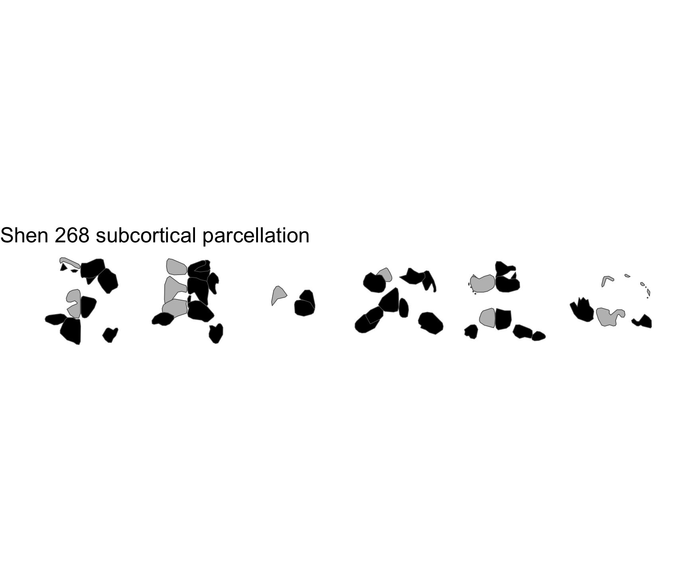

<!-- README.md is generated from README.qmd. Please edit that file -->

# ggsegShen

> **Work in Progress** – This package is under active development and
> has not yet been officially released.

Shen 268-node functional parcellation for the ggseg ecosystem.

## Installation

We recommend installing the ggseg-atlases through the ggseg
[r-universe](https://ggseg.r-universe.dev/ui#builds):

``` r
options(repos = c(
  ggseg = "https://ggseg.r-universe.dev",
  CRAN = "https://cloud.r-project.org"
))

install.packages("ggsegShen")
```

You can install this package from [GitHub](https://github.com/) with:

``` r
# install.packages("pak")
pak::pak("ggseg/ggsegShen")
```

## Cortical atlas

``` r
library(ggseg)
library(ggsegShen)
library(ggplot2)

ggplot() +
  geom_brain(
    atlas = shen268_cortical(),
    mapping = aes(fill = label),
    position = position_brain(hemi ~ view),
    show.legend = FALSE
  ) +
  scale_fill_manual(values = shen268_cortical()$palette, na.value = "grey") +
  theme_void() +
  ggtitle("Shen 268 cortical parcellation")
```


## Subcortical atlas

``` r
ggplot() +
  geom_brain(
    atlas = shen268_subcortical(),
    mapping = aes(fill = label),
    position = position_brain(. ~ view),
    show.legend = FALSE
  ) +
  scale_fill_manual(values = shen268_subcortical()$palette, na.value = "grey") +
  theme_void() +
  ggtitle("Shen 268 subcortical parcellation")
```



## Reference

Shen X et al. (2013). Groupwise whole-brain parcellation from
resting-state fMRI data for network node identification. *NeuroImage*,
82, 403-415.

## Code of Conduct

Please note that the ggsegShen project is released with a [Contributor
Code of Conduct](CODE_OF_CONDUCT.md). By contributing to this project,
you agree to abide by its terms.
